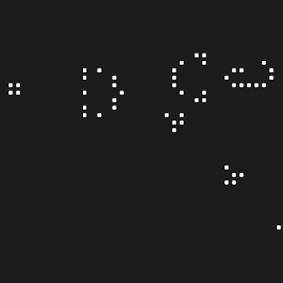

# for-fun-projects
Coding projects done for fun. Code may be dated and not reflect my current skills.

## [A custom implementation of Conway's Game of Life](game-of-life)

Functionality demonstrations GIF highlights:

    
    
    
    

During my initial stages of learning Java, I took on the challenge of implementing Conway's Game of Life as a learning exercise. Full details in [game-of-life/README](game-of-life/README.md).