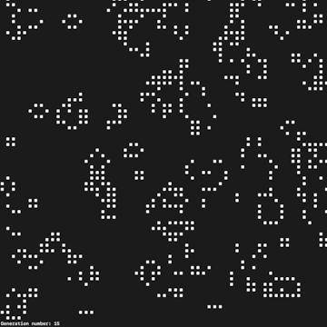

# for-fun-projects
Coding projects done for fun. Code may be dated and not reflect my current skills.

## [(WIP) CalCraft: Android Calculator Learning Project](CalCraft)

Current state demo GIFs:

    
    
    

CalCraft is an Android calculator app developed as part of a learning project in Kotlin. The project focuses on solving the order of operations in mathematical calculations with a completely custom solution built from scratch by me. This approach allowed for practical experience with classes, interfaces, and creating an extendable code architecture. The app includes basic arithmetic operations, decimal support, a scrollable history of calculations, and is planned to be expanded with scientific functions and improved UI features. The project serves as a showcase of my problem-solving skills in software development, particularly when working on complex algorithms that handle many interconnected possibilities.

## [A custom implementation of Conway's Game of Life](game-of-life)

Functionality demonstrations GIF highlights:

    
    
    
    

During my initial stages of learning Java, I took on the challenge of implementing Conway's Game of Life as a learning exercise. Full details in [game-of-life/README](game-of-life/README.md).

