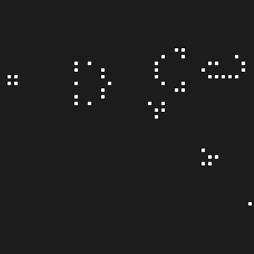

# Game Of Life in Java

## A custom implementation of Conway's Game of Life

***Disclaimer: This project was undertaken as a technical exercise in the past. As such, <span style="color:red">the code may not reflect my current level of expertise or best practices.</span>***

Functionality demonstrations GIF highlights:

<div style="display: inline-block;">
    
    
    
    
</div>

During my initial stages of learning Java, I took on the challenge of implementing Conway's Game of Life as a learning exercise. Here's what I accomplished:

* I built the entire game based solely on the original rules, without looking at any existing online implementations.
* I developed a custom pattern loader designed for straightforward seed copying directly from visual sources, such as online images. To showcase and validate the program's functionality, I've included several renowned patterns. As an example, here's how the seed for the famous Gosper glider gun looks in my code:

```java
case GOSPER_GLIDER_GUN:
                seed01 = "x x x x x x x x x x x x x x x x x x x x x x x x ■ x x x x x x x x x x x x x x x"; 
                seed02 = "x x x x x x x x x x x x x x x x x x x x x x ■ x ■ x x x x x x x x x x x x x x x"; 
                seed03 = "x x x x x x x x x x x x ■ ■ x x x x x x ■ ■ x x x x x x x x x x x x ■ ■ x x x x"; 
                seed04 = "x x x x x x x x x x x ■ x x x ■ x x x x ■ ■ x x x x x x x x x x x x ■ ■ x x x x"; 
                seed05 = "■ ■ x x x x x x x x ■ x x x x x ■ x x x ■ ■ x x x x x x x x x x x x x x x x x x"; 
                seed06 = "■ ■ x x x x x x x x ■ x x x ■ x ■ ■ x x x x ■ x ■ x x x x x x x x x x x x x x x"; 
                seed07 = "x x x x x x x x x x ■ x x x x x ■ x x x x x x x ■ x x x x x x x x x x x x x x x"; 
                seed08 = "x x x x x x x x x x x ■ x x x ■ x x x x x x x x x x x x x x x x x x x x x x x x"; 
                seed09 = "x x x x x x x x x x x x ■ ■ x x x x x x x x x x x x x x x x x x x x x x x x x x"; 
                seed10 = "x x x x x x x x x x x x x x x x x x x x x x x x x x x x x x x x x x x x x x x x";
                break;
```

To experiment more generally, I added functionality that allows cells to be populated randomly as well.

The game runs via the command line, and all configurations are set in the code before compilation. There are several calls to the patternLoader at the beginning that you can uncomment to try out. It set by default to launch the previous Gosper glider gun.

```java
public static void main(String[] args) {
        setTheBoard();
        patternLoader(PatternLib.GOSPER_GLIDER_GUN,10,10);
        // patternLoader(PatternLib.PULSAR,5,5);
        // patternLoader(PatternLib.PULSAR,0,25);
        // patternLoader(PatternLib.METAPIXEL,15,15);
```